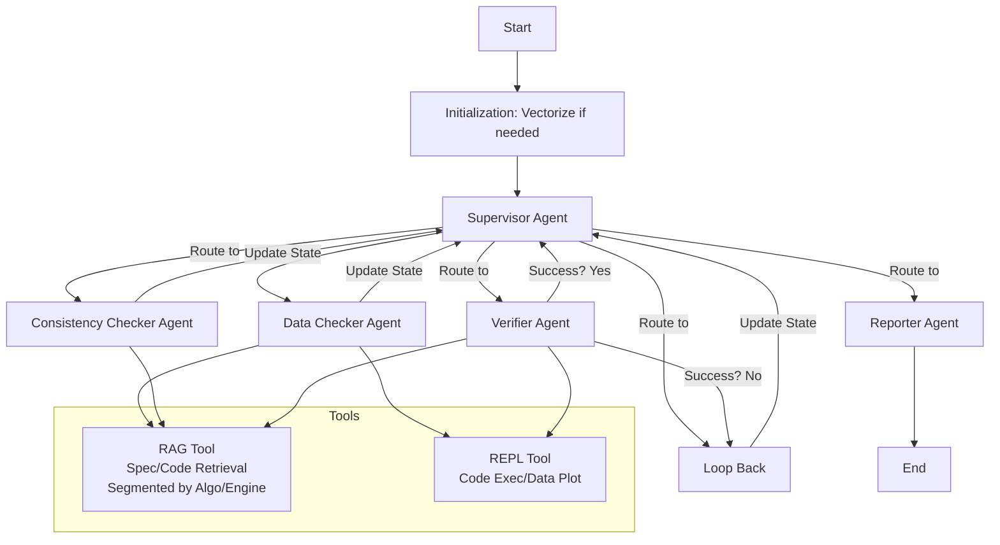
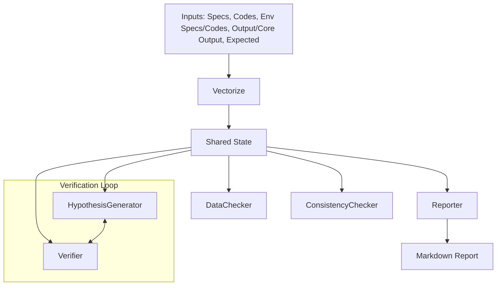

# 時系列処理アルゴリズムの課題分析システム 仕様書 (更新版)

## 1. 概要
この仕様書は、時系列処理アルゴリズムの課題分析をAIを用いて実施するシステムの設計を定義する。以前の仕様書を基に、ユーザーの追加要求を整理・統合して更新。主な変更点：
- 入力データの明確化（CSV形式、エンコーディング: UTF-8、JSONスキーマ: 時系列列を含むフラット構造）。
- 期待値の形式: 自然言語記述（例: "フレームxからyまでに列zに1が存在すること"）。
- 報告フォーマットの更新: 指定されたMarkdownテンプレートを使用。プロットの複数種類対応（アルゴリズム出力とコア出力の時系列グラフ）。
- RAG知識ベース: 事前（システム初期化時）インデックス化。外部DB不使用。
- REPLセキュリティ: 制限なし、uv環境内で実行。
- スケーラビリティ/エラー通知/国際化: 不要。
- 新規入力追加: アルゴリズム評価用環境の仕様（複数Markdown）と対応ソースコード（Python）。これらには、コアライブラリ出力の入力方法とCSV出力仕様が記載。
- 単一データ分析前提: システムは単一のアルゴリズム出力結果を分析。RAGベクトル化は初期化時またはベクトルデータ不存在時のみ実施。アルゴリズム・エンジン種類ごとにセグメント化してベクトル化（例: エンジンAのドキュメント群を別ベクトルストアに）。
- 解析具体例の統合: 指定された挙動を実現可能。システムのプロセスフローを調整し、単一データ対応のフローを定義。RAG/REPLを活用して入出力確認、仮説設定/検証を実施。

目的: 時系列データ（例: 動画フレームベースのセンサーデータ）を扱うアルゴリズムの課題を自動検出・分析。バグ、不整合、性能問題を報告し、開発支援。

適用範囲: 時系列データ限定。単一データセット対応。

前提条件:
- 入力データ: CSV (エンコーディング: UTF-8, 列: timestamp, value, etc.)。仕様書/Markdown: UTF-8。
- 期待値: 自然言語文字列。
- システム: Python環境、LangGraph v0.1.x+、LangChain v0.2.x+。

## 2. システムアーキテクチャ
LangGraphのSupervisorアーキテクチャ基盤。単一データ対応のため、Supervisorがサブフローを管理。RAGベクトル化は初期化ノードで条件付き実行。

### 2.1 高レベルアーキテクチャ図
Mermaid図で全体構造を示す。



- **説明**: InitでRAGベクトル化（存在チェック: ファイルハッシュ or DBクエリ）。Supervisorが単一データセットを処理。Toolsは単一データ対応（REPL: PandasでDFロード）。

### 2.2 詳細コンポーネント
#### 2.2.1 Initialization Node (新規追加)
- **役割**: システム起動時、RAG知識ベース構築。ベクトルデータ存在チェック（例: vectorstore.pickle存在）。不存在時のみベクトル化。
- **入力**: 全入力ドキュメント（仕様書、コード、評価環境仕様/コード）。
- **出力**: セグメント化ベクトルストア（例: {"engine_A": VectorStore, "algo_B": VectorStore}）。
- **実装**: LangChainのFAISS or Chroma。Embedding: OpenAI Embeddings。セグメント: ドキュメントメタデータで分類（{"type": "engine_A_spec"}）。
- **図: 初期化フロー**
  ```mermaid
  flowchart TD
      A[Start Init] --> B[Check Vectorstore Exists?]
      B -->|Yes| C[Load Existing]
      B -->|No| D[Segment Docs by Algo/Engine]
      D --> E[Embed & Index per Segment]
      E --> F[Save Vectorstore]
      C --> G[Update State]
      F --> G
  ```

#### 2.2.2 Supervisor Agent (更新)
- **役割**: フローを制御。単一データセットをルーティング。
- **入力**: 共有状態（MessagesState: 入力JSON）。
- **出力**: Command（goto="DataChecker"）。
- **プロンプト例**: "状態: {state}. 次ステップ決定: DataChecker, etc."
- **ツール**: なし。

#### 2.2.3 Data Checker Agent (更新: 評価環境対応)
- **役割**: 入出力データの確認。評価環境仕様/コードから列名/意味を抽出。CSVの概要確認（describe, info）。
- **入力**: 入力/出力/コア出力CSV、評価環境仕様。
- **出力**: 確認結果（例: "列'timestamp': 時系列, 'value': 検知値. describe: mean=0.5"）。グラフプロット（REPL: matplotlibで時系列plot）。
- **ツール**:
  - REPL: pd.read_csv(file); df.describe(); plt.plot(df['timestamp'], df['value']); plt.savefig('plot.png')
  - RAG: クエリ "CSV列の意味" で評価環境仕様検索。
- **プロンプト例**: "評価環境: {env_spec}. データ: {csv_paths}. 列詳細と概要を確認。"
- **図: データ確認フロー**
  ```mermaid
  flowchart TD
      A[Receive Dataset] --> C[Load CSVs via REPL]
      C --> D[RAG: Query Column Meanings]
      D --> E[Compute Stats: describe/info]
      E --> F[Plot Time Series: Algo & Core]
      F --> G[Update State]
  ```

#### 2.2.4 Consistency Checker Agent (更新: 期待値自然言語対応)
- **役割**: 仕様/評価環境との整合性調査。自然言語期待値解析（例: 正規表現でフレーム区間抽出）。
- **入力**: 出力データ、期待値（文字列）、評価環境。
- **出力**: 整合性レポート（例: "期待: フレーム1-10に'z'=1. 実際: 存在せず"）。
- **ツール**: RAG (仕様/環境検索), REPL (出力フィルタ: df[(df['frame'] >= x) & (df['frame'] <= y)]['z'].any() == 1)。
- **プロンプト例**: "期待値: {expected_text}. 出力: {output}. 整合性を自然言語解析で調査。"

#### 2.2.5 Hypothesis Generator Agent (更新: 具体例統合)
- **役割**: 仮説設定（例: "アルゴリズム仕様とコード不整合", "パラメータ不適切", "被験者想定外動作"）。確認結果とRAG参照。
- **入力**: チェック結果、不整合。
- **出力**: 仮説JSONリスト。
- **ツール**: RAG。
- **プロンプト例**: "不整合: {issues}. 仮説生成: 仕様不整合, パラメータ, 想定外動作など。"

#### 2.2.6 Verifier Agent (更新: ループ/REPL検証)
- **役割**: 仮説検証。REPLでテスト（例: コード修正実行, コア出力比較）。成功までループ（max 10回）。
- **入力**: 仮説, コード, データ。
- **出力**: 結果（成功フラグ, 詳細）。
- **ツール**: REPL (仮説テスト: コード実行/比較), RAG。
- **図: 検証ループ (具体例対応)**
  ```mermaid
  graph TD
      Start --> SetHypo[Set Hypothesis]
      SetHypo --> Verify[REPL Test: Code Exec/Compare Core]
      Verify --> Check[Success?]
      Check -->|Yes| Report
      Check -->|No| UpdateHypo[Update Hypothesis]
      UpdateHypo -->|Loop < Max| SetHypo
      UpdateHypo -->|Max Reached| Report[Partial Success]
  ```

#### 2.2.7 Reporter Agent (更新: 新フォーマット)
- **役割**: レポート生成。Mermaid/REPLで図/グラフ追加。
- **入力**: 全状態。
- **出力**: Markdownレポート。
- **ツール**: REPL (グラフ生成)。

### 2.3 データフロー図


## 3. プロセスフロー (具体例統合: 実現可能)
指定挙動は現在のアーキテクチャで実現可能。RAG/REPL活用で対応。
1. **入力受け取り**: データをStateにロード。
2. **システム初期化**: ベクトル化条件付き実行（セグメント化）。
3. **解析開始**:
   - **入出力確認**: 評価環境から列詳細抽出。REPLで概要/プロット。
   - **課題検証**: 仮説設定 (例: 不整合/パラメータ/想定外)。REPL検証ループ。
4. **レポート作成**: 新フォーマット使用。Mermaidで原因図、REPLでグラフ。

- **エラー処理**: ループ制限。
- **状態管理**: Persistent State。チェックポイント。

## 4. 報告Markdownフォーマット (更新)
指定テンプレートを使用。
```
<!-- これは個別データ分析レポートのサンプルです。 -->

# 個別データ分析レポート

## 概要

- 結論 : <!--結論は仮説検証にて確認した結果を記載-->
- 解析対象動画： <!-- videoデータが格納されているフォルダをリンク表記 -->
- フレーム区間: <!--評価区間を記載-->
- 期待値：<!--評価結果から取得-->
- 検知結果： <!--評価結果から取得-->

## 確認結果


アルゴリズム出力結果
 

コア出力結果

- 入出力の確認結果：<!-- 入出力の確認結果を記載 -->

- 考えられる原因1 : <!-- 考えられる課題要因を図や背景を交えて列挙 -->

## 推奨事項

- <!-- 推奨事項を記載 -->


## 参照した仕様/コード（抜粋）
... <!-- 仮説検証にて参照した仕様/コードを記載-->
```

- **拡張**: 原因部にMermaid図（例: 原因ツリー）。グラフ: REPL生成PNG埋込。
- **図: 報告構造**
  ```mermaid
  mindmap
    root((レポート))
      概要
        結論
        動画リンク
        区間
        期待/検知
      確認結果
        グラフ1
        グラフ2
        確認記述
        原因リスト
      推奨事項
      参照抜粋
  ```

## 5. 実装詳細 (更新)
- **LangGraph例** (擬似コード: 初期化追加):
  ```python
  from langgraph.graph import StateGraph, MessagesState
  from langchain.tools import Tool
  from langchain_openai import ChatOpenAI
  from langchain.vectorstores import FAISS
  from langchain.embeddings import OpenAIEmbeddings

  model = ChatOpenAI()
  embeddings = OpenAIEmbeddings()
  rag_tool = Tool(name="RAG", func=lambda q, segment: vectorstores[segment].similarity_search(q))
  repl_tool = Tool(name="REPL", func=code_execution)  # uv環境

  def init_vectorize(state):
      if not vectorstore_exists():
          docs = segment_docs(state['inputs'])  # by algo/engine
          for seg, doc_list in docs.items():
              vectorstores[seg] = FAISS.from_documents(doc_list, embeddings)
          save_vectorstores()
      return state

  def supervisor(state):
      # route state through agents
      return state

  builder = StateGraph(MessagesState)
  builder.add_node("init", init_vectorize)
  builder.add_node("supervisor", supervisor)
  # 他のノード...
  builder.set_entry_point("init")
  builder.add_conditional_edges("verifier", lambda s: "hypothesis_generator" if not s["success"] else "reporter")
  graph = builder.compile(checkpointer=True)
  ```

- **RAG**: セグメント化VectorStore。クエリ時: segment指定。
- **REPL**: pd.read_csv(file)
- **解析具体例実現**: 上記フローでカバー。仮説例直接プロンプトに組み込み。

## 6. テストと検証
- ユニット: 各エージェント/初期化テスト。
- インテグレーション: サンプルデータでE2E。
- 辺境: ベクトル不存在時。

## 7. 追加の疑問点
なし。全ての質問事項が回答され、仕様に統合。追加情報があれば再更新可能。