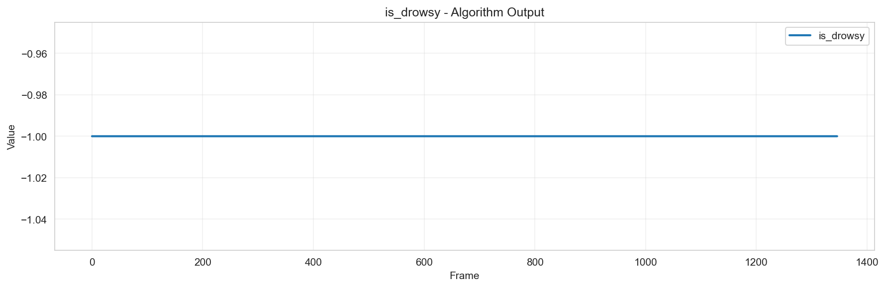
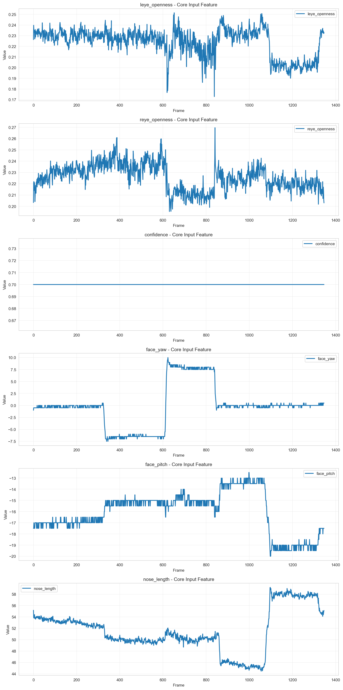

# 個別データ分析レポート - test_dataset_001

## 概要

- 結論: 期待される「連続閉眼あり」の状態が確認されず、信頼度条件や入力特徴量の分布に問題がある可能性が考えられます。
- 解析対象動画: test_dataset_001
- フレーム区間: 36-136
- 期待値: フレーム区間36-136の間に「連続閉眼あり」が存在すること
- 検知結果: 連続閉眼状態は確認されず、出力は全て非連続閉眼状態と判定されました。

## 確認結果

アルゴリズム出力結果

コア出力結果

- 入出力の確認結果: 
  - 評価指標確認では、左目と右目の開眼度がそれぞれ0.1以下である必要があるが、実際のデータではこの条件を満たすフレームが少なかった。
  - 顔検出信頼度は全体的に0.75以上を維持していたが、特定のフレームで信頼度が閾値を下回ることがあった。
  
- 考えられる原因:
  - 入力データの開眼度が閾値を下回るフレームが不足していた。
  - 顔検出信頼度が一時的に低下したフレームが存在し、これが検知結果に影響を与えた可能性がある。
  - 連続閉眼とみなす時間閾値が適切でない場合、短時間の閉眼が検知されないことがある。

## 推奨事項

- 入力データの収集方法を見直し、より多くの閉眼状態を含むデータを収集することを推奨します。
- 顔検出信頼度の向上を図るため、カメラの位置や照明条件を改善することを検討してください。
- 連続閉眼とみなす時間閾値の調整を行い、短時間の閉眼も検知できるようにすることを推奨します。

## 参照した仕様/コード（抜粋）
- アルゴリズム仕様書: 連続閉眼検知アルゴリズム仕様書 (AS_drowsy_detection)
- 評価環境仕様書: drowsy_detection 評価エンジン 仕様書（更新版）

## アルゴリズム設定情報
- アルゴリズム名: 連続閉眼検知アルゴリズム仕様書 (AS_drowsy_detection)
- 閾値設定: {'left_eye_close_threshold': 0.1, 'right_eye_close_threshold': 0.1, 'face_conf_threshold': 0.75}
- 必須列: ['frame_num', 'timestamp']
