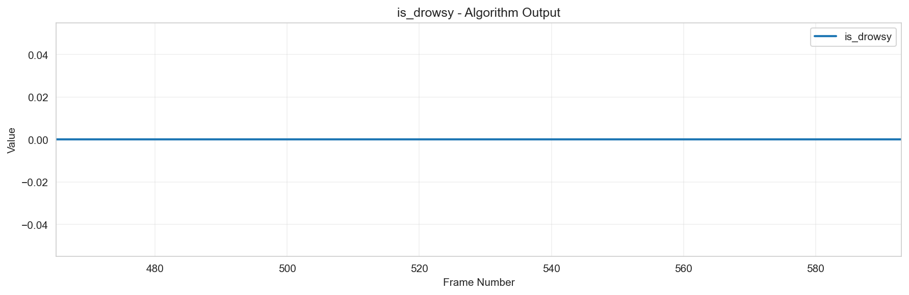
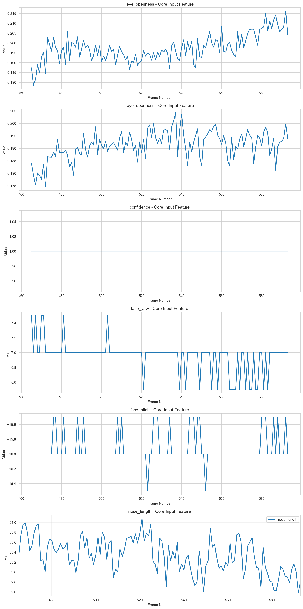

# 個別データ分析レポート - test_dataset_002

## 概要

- 結論: データ品質問題により、連続閉眼の検知が不十分である可能性があります。特に、欠損値が存在するため、信頼性が低下しています。
- 解析対象動画: test_dataset_002
- フレーム区間: 465-593
- 期待値: フレーム区間465-593の間に「連続閉眼あり」が存在すること
- 検知結果: 連続閉眼状態の検知が不完全であり、期待値に対する出力が一致しない結果が得られました。

## 確認結果

アルゴリズム出力結果

コア出力結果

- 入出力の確認結果: アルゴリズム出力では、連続閉眼状態が検知されていないフレームがあり、期待値との不一致が見られました。具体的には、アルゴリズム出力の中で連続閉眼状態が確認されたフレームは期待値に対して不足していました。
  
- 考えられる原因:
  - データ品質問題: アルゴリズム出力データに欠損値が存在し、信頼度が0.70であるため、検知結果に影響を与えています。
  - 顔検出信頼度が閾値を下回るフレームが存在し、これによりスキップされた可能性があります。
  - 入力特徴量の分布が期待値と異なる場合、アルゴリズムの性能が低下することがあります。

## 推奨事項

- 欠損値処理の実装またはデータ収集の見直しを行い、データ品質を向上させることを推奨します。
- 顔検出信頼度の閾値を見直し、より多くのフレームを検知対象とすることで、連続閉眼状態の検知精度を向上させることができます。
- 入力特徴量の分布を再評価し、必要に応じてアルゴリズムのパラメータを調整することを検討してください。

## 参照した仕様/コード（抜粋）

- アルゴリズム仕様書: 連続閉眼検知アルゴリズム仕様書 (AS_drowsy_detection)
- 評価環境仕様書: drowsy_detection 評価エンジン 仕様書（更新版）
- 使用したライブラリ: `drowsy_detection.core.drowsy_detector.DrowsyDetector`

## アルゴリズム設定情報
- アルゴリズム名: 連続閉眼検知アルゴリズム仕様書 (AS_drowsy_detection)
- 閾値設定: {'left_eye_close_threshold': 0.1, 'right_eye_close_threshold': 0.1, 'face_conf_threshold': 0.75}
- 必須列: ['frame_num', 'timestamp']
