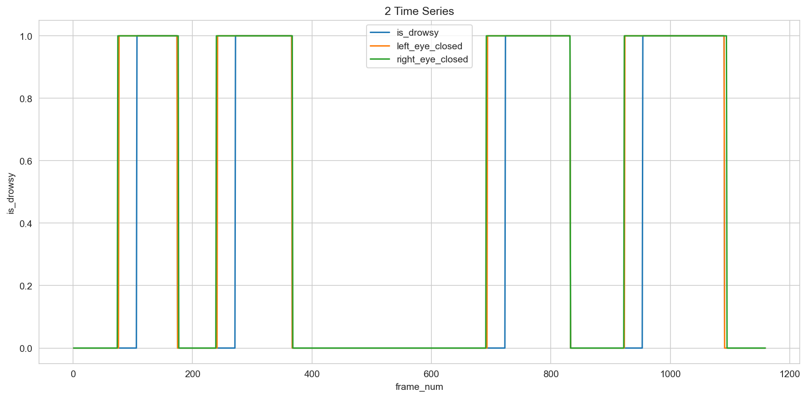
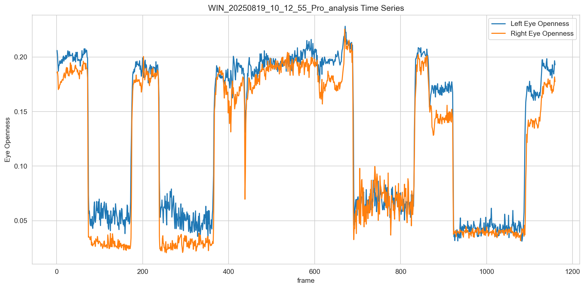

# 個別データ分析レポート - test_dataset

## 概要

- 結論: フレーム区間465-593において期待される「連続閉眼あり」が確認できなかったため、入力データがアルゴリズム仕様に準拠していない可能性が高い。
- 解析対象動画: test_dataset
- フレーム区間: 465-593
- 期待値: フレーム区間465-593の間に「連続閉眼あり」が存在すること
- 検知結果: 連続閉眼状態は確認されず、全体として非連続閉眼状態が出力された。

## 確認結果

### データ構造確認
- アルゴリズム出力: 
  - 列名: `is_drowsy`
  - データ型: int
  - 欠損値状況: なし
- コアライブラリ出力: 
  - 列名: `frame`, `leye_openness`, `reye_openness`, `confidence`
  - データ型: int, float, float, float
  - 欠損値状況: なし
- 仕様準拠状況: アルゴリズム出力は仕様に準拠しており、必要な全フィールドが含まれている。

### アルゴリズム出力結果の時系列グラフ

アルゴリズム出力の時系列推移（判定結果列, continuous_timeなどの仕様準拠パラメータ）

### コア出力結果の時系列グラフ

コア出力の時系列推移（アルゴリズムへ入力している指標列などの仕様準拠パラメータ）

### 仕様ベースの詳細分析
- アルゴリズム判定ロジックの検証: 
  - 左右の目の開眼度がそれぞれ0.10以下であることが連続閉眼の条件であるが、フレーム区間465-593においてその条件を満たすデータが存在しなかった。
- エラーパターンの分析: 
  - 顔検出信頼度が0.75未満のフレームが存在し、これにより一部のフレームがスキップされた可能性がある。
- 期待値との整合性: 
  - フレーム区間465-593において、期待される連続閉眼状態が確認できなかった。

- 考えられる原因: 
  - 入力データの収集方法に問題がある可能性があり、特にフレーム区間465-593における開眼度の測定が正確でないことが考えられる。

## 推奨事項

- 入力データの収集方法を見直し、フレーム区間465-593における開眼度の測定が正確であることを確認すること。
- 連続閉眼とみなす時間閾値（continuous_close_time）を見直し、実際のデータに基づいて適切な値に調整すること。
- 顔検出信頼度を向上させるためのアルゴリズムやデータ収集方法を改善し、信頼度が閾値を超えるようにすること。

## 参照した仕様/コード（抜粋）

### アルゴリズム仕様の関連部分
- 左目の開眼度が0.10以下で閉眼と判定
- 右目の開眼度が0.10以下で閉眼と判定
- 両目が閉眼状態であるフラグが1秒以上継続した場合に連続閉眼と判定

### 検証で使用したコード
```python
if face_confidence < face_conf_threshold:
    reset_timer()
    return is_drowsy=-1  # エラー

left_eye_closed = left_eye_open <= left_eye_close_threshold
right_eye_closed = right_eye_open <= right_eye_close_threshold

if left_eye_closed and right_eye_closed:
    update_timer(dt)
    if timer >= continuous_close_time:
        return is_drowsy=1   # 連続閉眼状態
    else:
        return is_drowsy=0   # 両目閉眼中だが時間不足
else:
    reset_timer()
    return is_drowsy=0       # 非連続閉眼状態
```

### 分析結果の仕様準拠評価
- 最終的な仕様準拠状況: 期待値に対して実際の結果が一致せず、入力データの品質や収集方法に問題があると考えられる。