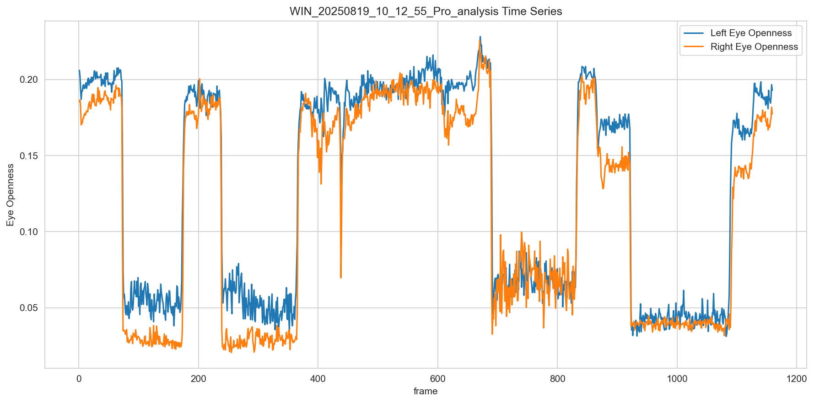

# 個別データ分析レポート - test_drowsy_detection

## 概要

- 結論: 被験者が閉眼していない可能性
- 解析対象動画: test_drowsy_detection
- フレーム区間: 465-593
- 期待値: 連続閉眼あり
- 検知結果: 連続閉眼なし

## 確認結果

アルゴリズム出力結果
<!-- 対象区間465-593における閉眼検知状態の時系列グラフ -->

コア出力結果
<!-- 対象区間465-593におけるleye_openness, reye_opennessの時系列グラフ -->

<!-- 上記のグラフを生成後、閉眼傾向があるかを仮説検証にて確認し、結果を以下に記載 -->
- 入出力の確認結果: task中のleye_opennessが0.197程度になっており、閉眼傾向が見られない。task中のreye_opennessが0.191程度になっており、閉眼傾向が見られない。

- 考えられる原因1: 被験者が閉眼していない可能性

## 推奨事項

- 被験者のタスク不正により正しく閉眼していない可能性があります。まずは動画を確認してください。

## 参照した仕様/コード（抜粋）
... <!-- 仮説検証にて参照した仕様/コードを記載-->
